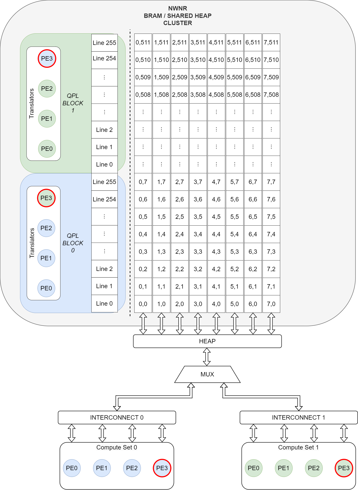

# QuickPageLite
Faster and Lighter version of QuickPage for small near Shared-Memory.

## Introduction
**QuickPageLite** (QPL) introduces support for *malloc()* and *free()* into *Shared-Memory*(BRAMs). The distinctive 
features of QPL include:\
&emsp; (1) Low latency **O(1) allocation** @100MHz (3 cycles for valid reply, pipelined).\
&emsp; (2) Low latency **O(1) deallocation** @100MHz (3 cycles for valid reply, pipelined).\
&emsp; (3) **Single cycle** virtual to physical address translation (upto 128 lines of managed memory).  
&emsp;&emsp;&nbsp; Additional 1 cycle overhead for context switch between allocated objects in the heap.\
&emsp; (4) Support for concurrent multi-thread heap-access/translation through *scalable Translator*.\
&emsp; (5) **AXI Stream** based user side control.\

Figure 1.: Depiction of how QPL integrates in-between the compute and shared-memory (heap) blocks.

## Project Structure and Setup
The project was synthesized and verified using *Vivado 2023.2*. First, run [script](/script/qpl_top_gen.py) \
to generate the top level wrappers for synthesis and verification. Perform modifications and verify using \
testbench present in [tb](/tb/). Synthesize from the contents of [src](/src/) using custom constraints. An example \
constraint and corresponding synthesized netlist is provided in [synth](/synth/). This synthesized rtl can be used \
with the synthesis testbench to perform post-synthesis functional verification.

Project
├───docs
│   ├───img
│   ├───misc
│   └───support
├───example
│   ├───qpl_1wNr_heap
│   └───qpl_NwNr_heap
├───script
├───src
├───synth
│   ├───constraint
│   └───rtl
├───tb
└───tmpl

## System Overview
The *Manager* unit is responsible for page-table operations (alloc and dealloc), while the *Transactor* handles 
concurrent translation of all incoming virtual address ports. QPL provides flexibility through *parameters*, whose 
functionality are described below along with their respective I/O in the following tables.

### Parameter Table

| Parameter         | Functionality                                                                                           |
| :---------------- | :------------------------------------------------------------------------------------------------------ |
| BUF_D        		| (De)Allocator AXIS FIFO depth (valid_vals = $2^n$ - 1 | n = 3, 4, 5, ...). 		                      |
| BUF_OREG_EN       | Enable output register of (de)allocator AXIS FIFO (disable to reduce alloc latency by 1).  Sits between AXIS FIFO and Manager in figure 1. |
| TBUF_OREG_EN		| Enable output register of translator AXIS (enabling will add 1 to translation latency).  Sits between Translation port and Transactor in figure 1.  |
| MEM_OREG_EN		| Enable output register of transactor (enabling will add 1 to translation latency).  Sits at the output of (Base/Aux) decoders in figure 1.  |
| CHANS             | Number of independent primary/base virtual address translator channels.								  |
| DUAL_PORT			| Enable to generate auxiliary virtual address translator channels in-addition to base channel.			  |
| LINE_BYTE         | The number of bytes per line in a block, in heap. Sets the minimum allocation granularity per block.	  |
| LINE_WORD			| The number of words per line in a block, in heap.														  |
| BLOCK_D           | Number of lines per block, or the search space over which an object may be dynamically allocated.  	  |
| UDATA_W		    | User data field width in request and reply packets.													  |

The following are *non-mutable* parameters which are automatically derived from the above parameter values.

| Parameter         | Functionality                                                                                           |
| :---------------- | :------------------------------------------------------------------------------------------------------ |
| BLOCK_W			| Bit length to represent total number of lines in heap memory.											  |
| REQ_S             | Maximum allocable request size of an object in bytes. Granularity depends upon LINE_BYTE param.         |
| REQ_W             | Bit length to represent REQ_S (inclusive).                                                              |
| REP_W             | Bit length to reprsent the reply from QPL after a successful allocation.								  |
| VADDR_W           | Bit length to represent virtual address to translator.                                                  |
| PADDR_W           | Bit length to represent physical address to memory module (post translation).                           |

### I/O Table

| Pin               			| Description                                                                                             |
| :-----------------------------| :------------------------------------------------------------------------------------------------------ |
| i_clk             			| Clock input.                                                                                            |
| i_rst           				| Synchronous reset input (active high).                                                             	  |
| i_req_alloc AXIS interface	| Allocation request stream interface (without side-channels).											  |
| i_req_dealloc AXIS interface	| Deallocation request stream interface (without side-channels).										  |
| i_rep_alloc AXIS interface	| Allocation reply stream interface (without side-channels).											  |
| i_rep_dealloc AXIS interface	| Deallocation reply stream interface (without side-channels).											  |
| i_base_addr AXIS interface(s)	| Base translator channel AXIS port (with tuser and tlast side channles). Interface repeated CHANS times. |
| i_aux_addr AXIS interface(s)	| Auxiliary translator channel AXIS port (with tuser and tlast). Interface repeated CHANS times.		  |
|								|																										  |
| o_blk_full					| Boolean output port indicating if QPL block is full (out of heap memory).								  |
| o_blk_avail					| Scalar output indicating the available number of free lines in QPL heap memory.						  |
| o_blk_base_we					| Translated physical address of base channel write_enable signal towards heap memory.					  |
| o_blk_aux_we					| Translated physical address of auxiliary channel write_enable signal towards heap memory.				  |
| o_blk_base_addr				| Translated physical address of base channel towards heap.												  |
| o_blk_aux_addr				| Translated physical address of auxiliary channel towards heap.										  |

\[Each of the base and auxiliary channel ports are replicated based on the CHANS parameter.\]

Having described the parameters and the features they configure, let's look at a pictorial explanation of how QPL tracks and maintains the \
map between virtual and physical memory, and performs fast translation from virtual to physical address space. Followed by the description \
of AXIS packet and signal behaviours used to operate QPL.

## Background
Low-latency paging demands can be primarily defined by the following 3 conditions. (1) **Allocation** requires an ordered list of free *lines* in \
heap (free-list), to avoid wasting precious cycles by walking through an unordered list. (2) **Deallocation** mandates the parallel re-ordering of \
free/full list (housekeeping of base_pointers), while (3) **Translation** requires a quick mechanism to trace a virtual address to its corresponding \
physical line in heap memory.

Figure 2.: Visualisation of low-latency paging demands (free_full list) of a heap with *8 lines / Minimum-Allocable-Unit (MAUs)*. \
The *Base_Pointer* of an object in heap are represented by a red perimeter in both physical and virtual maps.

The required behaviour shown in figure 2 can be realized through the **Inverse Butterfly Network** (ibfly) as shown in figure 3.

Figure 3.: Inverse Butterfly Network mapping virtual space to physical and vice-versa. The changes of the virtual and physical map \
are marked by a time stamp along with delta time step as @T(x, y), where x is the current time and y is the delta step. The ibfly \
network is shown along with its switch positions at time T(x, 0). The switch can be in a bar (0) or cross (1) configuration as \
shown by the dotted lines within the switch. The switch-control-bits (SCBs) are show as red numbers within the corresponding switch.

As seen in the final time stamp @T(2,1), the new object is contiguous and ordered in virtual map. But, the physical map representation of the same \
object is unordered and non-contiguous. Therefore, any access from the perspective of the processing-unit / user is contiguous in virtual space and \
translated to the physical space by through the ibfly structure using the SCBs.

Figure 4.: Physical to virtual address translation using SCBs generated from a ibfly structure.

The SCBs generated by the ibfly convey the *State* of the free/full list. Hence, the translator utilizes this information to convert back and forth \
between virtual and physical address space. The translator takes an input address (physical in figure 4) to select the appropriate group of SCBs per \
stage in the complete-binary-tree (CBT) and generates the appropriate target address (virtual in figure 4).

## Object (De)Allocation
An object is group of lines in QPL heap memory, that are virtualy contiguous from the user's perspective. The allocator consumes a request \
from the user through the AXIS port and allocates multiples of LINE_BYTE in QPL heap. The request size is specified in bytes, which are \
automatically converted in-terms of number of lines in heap, for allocation.

### Request Packet

Figure 5.: Packet field description of allocation request (from user to QPL).

The *USER_DATA* field width is controlled by *UDATA_W* parameter and can be used share user defined data with the allocator. The total width \
of the request packet *REQ_W* can be derived from the configurable parameters *LINE_BYTE*, *BLOCK_D*, and *UDATA_W*. In the event QPL heap is \
full, the FIFO will buffer (depth configured by *BUF_D*) incomming packets till the buffer overflows. None of the un-allocated requests in the \
buffer will be dropped. Allocator will wait till further space is created in the heap (through deallocation).

### Reply Packet

Figure 6.: Packet field description of allocation reply (from QPL to user).

Upon successful allocation, the allocator will reply with a valid packet as shown in figure 3. QPL is currently designed to replay the *USER_DATA* \
seen during allocation request for a corresponding reply's *QPL_DATA*. Essentially, the user data field is used as a packet ID to match requests to replies. \
The second field of the reply packet holds the pointer to the allocated *Object* in heap. The *tag* of an object pointer is generated from the \
physical address space of the allocated object (physical map base_ptr in figure 2).

It is important to store the *Object_Ptr* on the user side for future correspondence with QPL. The *size* field (BLOCK_W + 1) is used during \
deallocation and the *tag* field is heavily used during virtual address translation.

### Deallocation
An object's deallocation is initiated by sending the *Object_Ptr* to QPL. The deallocation mechanism is rudimentary and does not provide security features \
to filter spam *Object_Ptr*. QPL will perform deallocation of ghost objects in memory, resulting in a corrupted heap (undefined state). Therefore care \
must be taken to ensure all deallocation requests sent, correspond to a valid existing object in memory.

### Interface
Request and reply packets are sent to QPL over the AXI4-Stream protocol with no side-channels as shown in figure 7.

Figure 7.: Timing diagram of QPL (de)allocator reques/reply AXI4-Stream interface with a reply latency of 3 cycles.

The *tdata* signal carries the request/reply packet discussed above, and any packet sent while QPL's *tready* is low, will be dropped at the FIFO.

## Translator
QPL translator can perform *single cycle* translation from virtual to physical address, **within the address space of the object of interest**. The \
selection of an object (loading the objects base_ptr) itself will incur a single cycle penalty. Hence, QPL is inherently designed to work with \
**transactions**, where majority of the time is spent on intra-object access and inter-object context switches are comparatively less frequent.

Figure 8.: Translator Packet field breakdown.

The number of translator instances can be controlled using the *CHANS* param. Each instance of *Translator* offers a base (primary) port and, if enabled by \
setting the *DUAL_PORT* param, an auxiliary (secondary) port for address translation. Prior to any transactions to an object/logical-address-space, the \
translator instance is oriented towards the object by sending a r/w packet whose *BASE_ID* field is filled with the *tag* part of the *Object_Ptr*, to the \
translator's base (primary) port. For safety, the translator does not reflect writes into memory when the write packet is used to set orientation. Once \
oreiented, all writes are reflected in memory. The second field in the packet (virtual address) is used to select a word from the logical address space of \
the object. The virtual address is a combination of *{Line, Word}*; where 'Line' can range from (0 - *BLOCK_D*-1) and 'Word' ranges from (0 - *LINE_WORD*-1).

Figure 9.: Transactor (wrapper for translaotrs) base port example waveform for AXI4-Stream interface (cycle accurate upto 128 lines per block).

The translator is meant to operate in a single cycle, hence there is no FIFO in it and the AXI4-Stream interface is for convenience. The *tlast* signal is \
repurposed to act as a *write_enable* (we) attached to the virtual address carried by *tdata*, referencing a virtual word in the logical address space \
oriented by the tag carried using *tuser*. An exapmle colour coded sequence of address space orientations followed by transactions are shown in figure 9. \
Since every port supports a we signal, QPL translators can be attached to both 'Simple-Dual-Port' (SDP) and 'True-Dual-Port' (TDP) configurations of BRAM.

The translator port outputs are made external by the QPL packed I/O ports *blk_we_\** and *blk_addr_\**, which follow the corresponding translator's \
*tlast* and *tdata* inputs respectively.

## QPL Verification and Performance Metrics
**Constrained Random Verification** of QPL is carried out using the testbench setup in [testbench](/tb/). The verification program is conducted as follows: \
&emsp; (1) Fill up heap by allocating objects of random size. \
&emsp; (2) Translate/monitor the logical address space of a randomly selected object 'A' in heap. \
&emsp; (3) Deallocate a randomly selected object 'B', which is guaranteed to affect the *state* of object 'A' in virtual memory. \
&emsp; (4) Translate/monitor the logical address space of 'A' post deallocation. \
&emsp; (5) Verify all (de)allocation replies and ensure the translated addresses of 'A' pre and post deallocation of 'B' are identical. \

**Synthesis** of QPL at various block sizes and ports is carried out using the contraint file in [synth][/synth/constraint/]. The resulting resource \
utilization is plotted in figure 10 for *Single-Port* (SP) and in figure 11 for *Dual-Port* (DP) configurations. All results were obtained on a **ZYNQ 7020** \
SoC (PYNQ-Z2 board) with QPL operating at 100MHz.

Figure 10.: Resource utilization of QPL at various block sizes and supported channels (single-port). Each line is marked as SPx where x is the number of \
supported ports.

Figure 11.: Resource utilization of QPL at various block sizes and supported channels (dual-port). Each line is marked as DPx where x is the number of \
supported ports.

The below table consolidates the QPL latency metrics related to allocation, deallocation and translation.

| Metric                           		| Description                                                                    							| Value (cycles)																											|
| :------------------------------------ | :-------------------------------------------------------------------------------------------------------- | :---------------------|
| Allocation Latency               		| Time required to perform an allocation and reply with a valid Object ID.       							| 3						|
| Deallocation Latency             		| Time required to perform a deallocation given a valid Ojbect.               								| 3						|
| Translator Object switch Latency  	| Overhead seen by user for object context switching at the respective port.                                | 1						|
| Translator Latency:					| Overhead incured for virtual to physical address translation:												|						|
|		BLOCK_D = 0 -> 128				|					of a block managing 0 to 128 lines in heap.												| 1						|
|		BLOCK_D = 256 -> 512			|					of a block managing 256 to 512 lines in heap.											| 2						|

## QPL Memory Block Configuration
This section descirbes some simple heap configurations realized using BRAMs, which can be integrated with QPL to build shared memory structures which \
exhibit *1-Write-N-Read* (1wNr) or *N-Write-N-Read* (NwNr) properties as shown in figures 12 and 13 respectively.

### 1-Write-N-Read

Figure 12.: 1-Write-N-Read QPL heap configuration maps a single BRAM (512 elems deep) into a 2D virtual space having 32 lines, each 8 elements deep. \
All BRAMs share a common write port and have independent read ports to support concurrency.

The 1wNr configuration is straight-forward to realize, operates in *single-port* mode resulting in better utilization scaling, and exhibits the \
lowest heap access latency of a **single-cycle** upto 128 lines of managed heap. But, the glaring drawback is the absence of concurrent write to heap.
For **streaming** applications which utilize a **serial-schedule-parallel-compute** paradigm, i.e., sequential stream-in (write to memory) followed by \
concurrent streams-out (parallel read from memory), can leverage *Runtime-Dynamic-Memory-Management* of shared memory using this memory configuration.

The 1wNr config heap access latency was estimated by synthesizing a test unit with QPL managing 128 lines of shared memory @100MHz. Each BRAM is treated \
as a 2D memory with 128 rows and 4 columns. Timing failed at 256 rows (2 columns) unless the *MEM_OREG_EN* param is set, introducing an additional cycle \
of latency. The number of translators (controlled by *CHANS* param) determine the number of read-ports generated for shared memory (BRAM cluster). \
The RTL and XDC files can be found at [ex_qpl_1wNr_heap](/example/qpl_1wNr_heap/).

### N-Write-N-Read

Figure 13.: N-Write-N-Read QPL heap configuration clusters multiple BRAMs together to make a 2D array. This opens up wide bit r/w options as each BRAM \
(bank) port can be independently accessed, through an interconnect.

The NwNr configuration is comparatively complex due to the presence of an interconnect. Furthermore, the interconnect introduces additional latency \
in addition to the latency introduced by the tranlator. The heap access latency was estimated using a test unit comprising of two QPL blocks, each \
managing 256 rows in shared memory with support for 4 translators per QPL block as shown in figure 14. The interconnect is a dummy ibfly network routing \
ingress ports to heap and back to egress ports, and the two QPL block access ports are multiplexed prior the BRAM @200MHz by a mux, reuslting in a total \
write latency of 3 cycles and read latency of 4 cycles.

Figure 14.: Example configuration with two independent sets of Processing-Elements (PEs), each having 16KB of logically exclusive shared-memory-blocks. \
The PEs and translator ports connections are shown through colour coding. Three threads (PEs) within a block/set have intra-block block access and a \
single PE (perimeter in red) per block is used for inter-block access. Both compute sets have independent (de)allocation control over their logical block.

The intent behind the config shown in figure 14 is to utilize 3 ports per QPL block for 3 threads and keep 1 port to provide access for external access \
from the other QPL block for memory sharing between two logically exclusive blocks. Resulting in 2 QPL instances each supporting 3 threads totaling to 6 \
compute threads and 2 copy/network threads to move data between logical block regions. The test unit in [ex_qpl_NwNr_heap](/example/qpl_NwNr_heap/) is only \
for estimation purposes and should not be considered as a template. This example is only meant to show how NwNr may be realized with QPL, and it is yet to \
pass *functional verification* or testing of any kind. The experiment was synthesized with compute sets operating at 100MHz and heap at 200MHz for *estimation*.

## Conclusion
QPL is the result of a journey to support low-latency *Runtime-Dynamic-Memory-Management* (DMM) and the reasoning behind the need for QPL, including references \
can be found in the reports present in [support](/docs/support/). The whole work is aimed towards providing a plug-n-play DMM module to realize various dynamic \
algorithms on FPGA. **Future work** will include extending QPL to support multi-block management, allowing for significant decrease in resource utilization by \
using a common (de)allocator mechanism at the expense of losing parallel block allocation. In-addition, further work will consist of building an accelerator \
around QPL (1wNr config) to asses if fast DMM does provide some performance benefits, or if all of this is just a convoluted day-dream :).

P.S: Please feel free to contact me (amruthj10@gmail.com) and critique this work.
